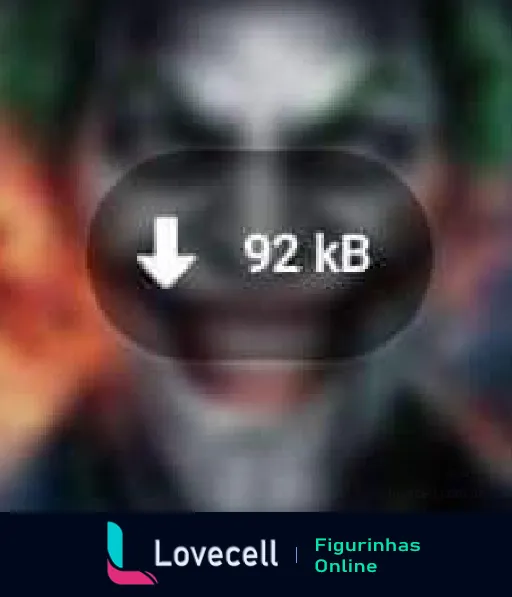

<!-- Comentário Ctrl + k + c

# Cabeçalo
##### cabessalo

<h1> Cabeçalho HTML </h1>
-->
<h1 align="center"> Baixar figurinha para whatsapp 2025 online gratis </h1>

    

## Descrição do Projeto

    
    
    Murray: Vocês já conhecem nosso próximo convidado, mas antes que ele apareça, eu só quero dizer que estamos todos de coração partido por causa do que está acontecendo na cidade. Mas foi assim que ele quis vir e acho que todos nós precisamos rir um pouco. Vamos dar as boas-vindas ao Coringa!

    Arthur sai das cortinas, dança ao som de uma versão orquestral de "Smile", beija a Dra. Sally na boca e se senta

    Murray: você está bem, Dra.?

    A plateia ri

    Murray: está tudo bem?

    A plateia ri novamente

    Arthur: sim, claro. É exatamente como eu imaginei

    Murray: bem, esse é um de nós!

    A plateia ri novamente

    Murray: o que sua aparição significa? Há algum tempo você me disse que não é político

    Arthur: é verdade, Murray, eu não sou político. Eu só quero fazer as pessoas rirem

    Murray: e funcionou para você?

    A plateia e Arthur riem

    Arthur: HAHAHAHAHA! HAHAHAHAHA!

    Murray: então você é um comediante. Você trabalhou em algum material novo? Você quer contar uma piada para nós?

    A plateia aplaude

    Arthur: sim, ok

    Arthur tira seu livro de piadas

    Murray: ele tem um livro! Um livro de piadas!

    A plateia ri e Arthur procura uma piada

    Murray: não se apresse, temos a noite toda

    A plateia ri novamente

    Arthur: ok, ok. Aqui vai uma. Toc, toc

    Murray: você teve que procurar isso?!

    A plateia ri novamente

    Arthur: eu quero fazer direito. Toc, toc

    Murray: quem está aí?

    Arthur: A polícia, madame. Seu filho foi atropelado por um motorista bêbado. Ele está morto

    A plateia vaiou e um membro da orquestra faz o barulho de "eu errei"

    Dra. Sally: não, não! Você não pode brincar com isso!

    Murray: isso não é engraçado, Arthur. Esse não é o tipo de humor que usamos no programa

    Arthur: sim, me desculpe. Acontece que foram semanas difíceis, Murray. Desde que eu... matei aqueles 3 caras da Wall Street

    A plateia arfa

    Murray: ok, estou esperando a piada

    Arthur: não tem piada. Não é uma piada

    A plateia murmura com desgosto

    Murray: você está falando sério? Você está me dizendo que matou aqueles 3 jovens no metrô?

    Arthur: mmm hmm

    Murray: e por que deveríamos acreditar em você?

    Arthur: eu não tenho mais nada a perder. Nada mais pode me machucar. Minha vida não é nada além de uma comédia

    A plateia vaiou novamente

    Murray: deixe-me entender. Você acha que matar aqueles homens foi engraçado?

    Arthur: sim, acho. E estou cansado de fingir que não foi. Comédia é subjetiva, Murray. Não é o que eles dizem? O sistema que sabe tanto decide o que é certo ou errado. Da mesma forma que você decide o que é engraçado ou não

    Homem da plateia: tire ele daqui!

    Murray: ok, acho que posso entender que você fez isso para iniciar um movimento para que você pudesse se tornar um símbolo?

    Arthur: vamos, Murray. Eu pareço um palhaço que poderia iniciar um movimento? Eu matei aqueles caras porque eles eram horríveis. Todo mundo é horrível hoje em dia. O suficiente para deixar alguém louco

    Murray: ok, então é isso. Você está louco. Essa é sua defesa por matar aqueles jovens?

    Arhur: não. Eles não conseguiam cantar uma nota para salvar suas vidas

    A plateia vaiou novamente

    Arthur: Ugh! Por que todo mundo está chateado com esses caras?! Se fosse eu morrendo na calçada, vocês passariam direto por mim! Eu passaria por vocês todos os dias e vocês não me notariam! E esses caras, o quê?! Porque Thomas Wayne chorou por eles na TV?!

    Murray: você tem um problema com Thomas Wayne?

    Arthur: sim, tenho! Você já viu como é lá fora, Murray? Você já sai do estúdio? Todo mundo só grita e berra um com o outro! Ninguém mais é civilizado! Ninguém pensa como é ser o outro cara! Você acha que homens como Thomas Wayne pensam como é ser alguém como eu? Ser alguém que não seja eles mesmos? Eles não pensam. Eles acham que vamos apenas sentar e levar como meninos! Que não vamos nos transformar em lobisomens e ficar selvagens!

    Murray: você terminou. É muita autocompaixão, Arthur. Você está apenas inventando desculpas para matar aqueles jovens. Nem todo mundo, e vou te dizer isso, nem todo mundo é horrível

    Arthur: você é horrível, Murray

    Murray: eu? Eu sou horrível? Ah, sim, como eu sou horrível?

    Arthur: tocando meu vídeo. Me convidando para o programa. Você só queria tirar sarro de mim! Você é como todo mundo!

    Murray: você não sabe nada sobre mim, cara. Olha o que aconteceu por causa do que você fez e aonde isso levou. Há tumultos nas ruas. 2 policiais estão em estado grave e você está rindo, você está rindo. Alguém foi morto hoje por causa do que você fez

    Arthur: Hahahahaha! Eu sei! Que tal outra piada, Murray?

    Murray: não, acho que já tivemos piadas suficientes suas

    Arthur: o que você ganha...

    Murray: eu acho que não

    Arthur: ...quando você cruza...

    Murray: acho que já tivemos piadas suficientes suas, é isso

    Arthur: ...um solitário mentalmente doente com uma sociedade que o abandona e o trata como lixo?!

    Murray: chame a polícia, Gene! Chame a polícia!

    Arthur: EU VOU TE DIZER O QUE VOCÊ GANHA!!!! VOCÊ GANHA O QUE VOCÊ MERECE!!!!

    Arthur atira na cabeça de Murray com sua arma, Murray morre e a plateia começa a correr e gritar de medo

    Arthur: HAHAHA!!!!! HAHAHAHA!!!!

    Arthur atira no corpo morto de Murray no peito, dança para a câmera e chega perto dela

    Arthur: boa noite. E lembre-se sempre disso: isso é...

<ul id="menu" align="left">
    <li><a href="https://github.com/Inktopodz"> Descrição do Projeto</li>

</ul>